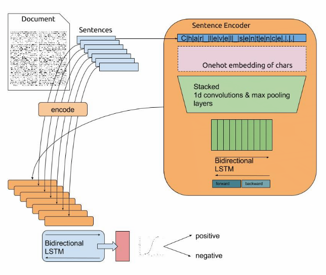

# Character level models

Repeat work from https://github.com/offbit/char-models

Requirements:

- pandas

- tensorflow 1.0

- keras 2.0

- numpy 

for more information go to offbit's [blogpost](https://offbit.github.io/how-to-read/)

update 17/03/2017: Models are updated for keras 2 and tf 1.0.
